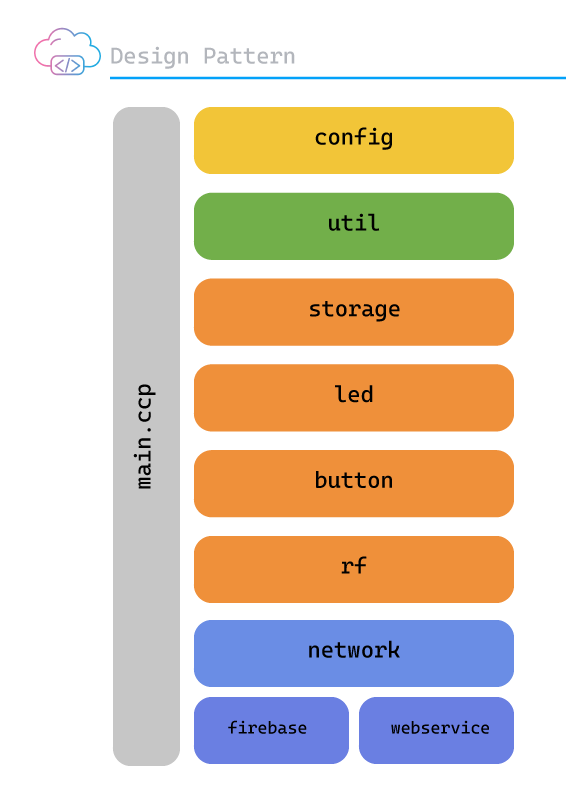

# Bit: Embedded System  (ESP8266)

## Arquitetura

Comunicacão entre os componentes da aplicação

> **main.ccp:** Define as configurações iniciais e registra as multi tasks
> 

> **config:** Configura o device globalmente
> 

> **util:** Define classes helpers
> 

> **storage**: Armazena todos os dados na memória non-volaties
> 

> **led:** Gerencia o módulo de led que indica o modo de operação atual.
> 

> **button:** Gerencia o evento de PULL_UP para troca entre o modo de operação
> 

> **rf:** Módulo responsável por receber e enviar sinais de rádio frequência no padrão Amplitude Shift Keyling - ASK
> 

> **network:** Responsável por gerenciar toda a comunicação com a internet.
> 

> **network:firebase:** Gerencia a comunicação com o RealTime Database
> 

> **network:webservice:** Responsável por gerenciar a comunicação entre o dispositivo o app mobile atrvés de um webservice API Rest.
> 

---

## Hardware

- Microcontrolador ESP8266
- Módulo Transmissor RF 433 MHZ
- Módulo Receiver RF 433 MHZ
- Antena 433 MHZ + IPEX 1.13 cable

---

## Software

- IDE
    - PlataformIO
    - Framework: Arduino
    - Programming Language: C++
- Libraries
    - *Scheduler*
        
        > Possibilita a criação de tasks que simula um Realtime operation system - RTOS, dando a possibilidade separar o código em tasks diferentes evitando o controle por mills() e interruptores.
        > 
        - lib_deps: nrwiersma/ESP8266Scheduler@^1.0
        - git: https://github.com/nrwiersma/ESP8266Scheduler
    - *Preferences*
        
        > Facilita a leitura e escrita na memória EEPROM do ESP8266
        > 
        - plataf: vshymanskyy/Preferences@^2.1.0
        - git: https://github.com/vshymanskyy/Preferences
    - *Arduino_JSON*
        
        > Facilita a leitura e escrita na memória EEPROM do ESP8266
        > 
        - lib: arduino-libraries/Arduino_JSON@^0.2.0
        - git: https://github.com/arduino-libraries/Arduino_JSON
    - Firebase ESP8266 Client
        
        > Biblioteca para comunicação com Google Firebase
        > 
        - lib_deps: mobizt/Firebase ESP8266 Client@^4.4.8
        - git: https://github.com/mobizt/Firebase-ESP8266
    - rc-switch
        
        > Responsável por fazer a leitura e envio do sinal de rádio frequência
        > 
        - lib: sui77/rc-switch@^2.6.4
        - git: https://github.com/sui77/rc-switch